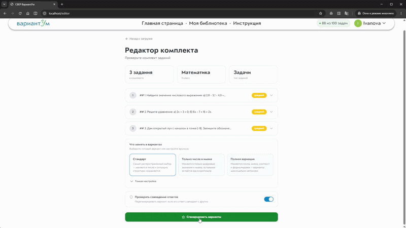
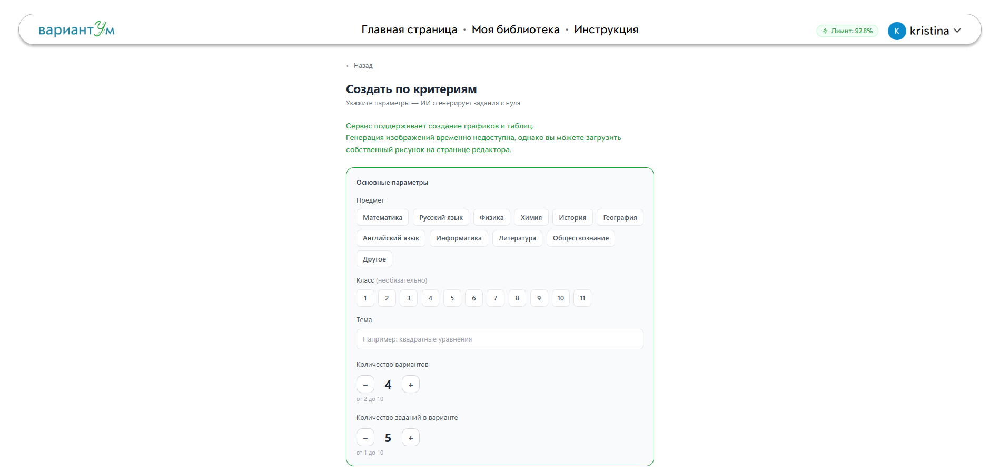
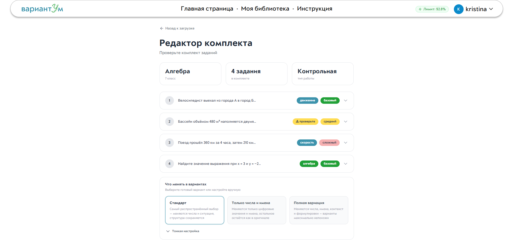
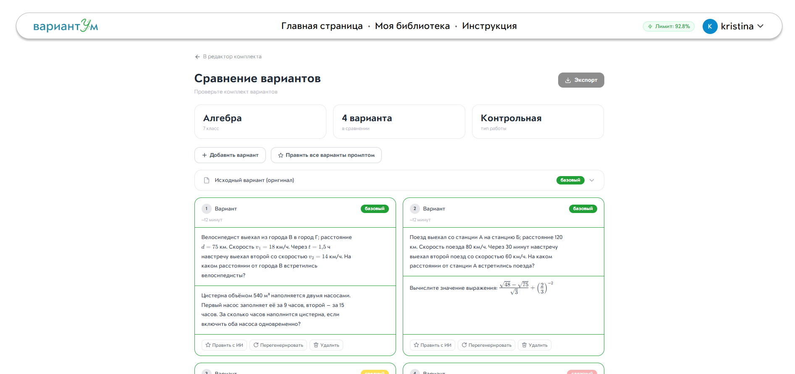
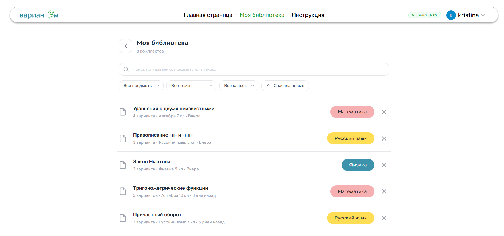
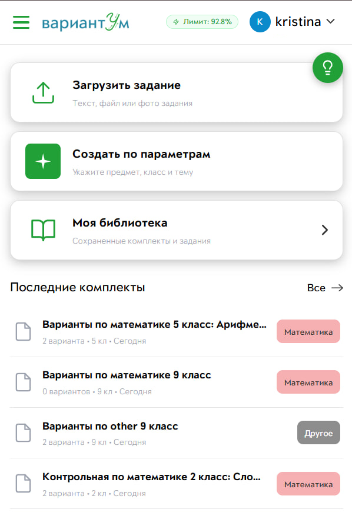

# ВариантУм

> **ИИ-сервис для автоматической генерации равносложных вариантов школьных контрольных работ.**

🥉 **3 место** · Хакатон СберОбразование × Школа 21 «ИИ для образования: автоматизация рутинных задач»

Один эталон из учебника — и за 5 минут вместо 2 часов учитель получает готовый комплект вариантов: одинаковых по сложности, разных по содержанию, сразу с ответами и экспортом в PDF/DOCX.



---

## 📸 Скриншоты

| Генерация вариантов | Редактор комплекта | Сравнение вариантов |
|---|---|---|
|  |  |  |

| Личная библиотека | Мобильная версия |
|---|---|
|  |  |

## Проблема

Учителя тратят от **40 минут до 2 часов** на ручное создание нескольких вариантов одной контрольной.  
При этом почти половина аудитории — педагоги 45+, которым сложно работать с перегруженными инструментами и ИИ-чатами.  
Обычный LLM-чат генерирует текст, но не решает методическую задачу: сохранить одинаковую сложность и структуру вариантов.

---

## Что было реализовано

### Три сценария работы

**1. Генерация по эталону**
Загружаете готовое задание (текст / PDF / DOCX / фото) — сервис анализирует структуру, выделяет инварианты и вариативные элементы, затем генерирует N вариантов того же типа и сложности. Распознавание через GigaChat Vision с Tesseract OCR как офлайн-фолбэком.

**2. Генерация по критериям**
Без эталона: задаёте предмет, класс, тему, тип заданий, количество вариантов, время выполнения и уровень сложности — комплект генерируется с нуля.

**3. Доработка из библиотеки**
Открываете сохранённый комплект из личной библиотеки и дорабатываете его: перегенерируете весь комплект, один вариант или одно задание.

### Редактор комплекта
- WYSIWYG-редактор с поддержкой формул (KaTeX / MathLive) и графиков функций
- Анализ варианта: класс, предмет, тип, количество заданий
- Настройки вариации для каждого задания или для всего комплекта сразу
- Три режима сложности: одинаковая / возрастающая / произвольная
- Чекбокс предотвращения совпадения ответов между вариантами

### Сравнение вариантов
- Параллельный просмотр всех вариантов одновременно
- Подсветка различий между вариантами
- История изменений (снимки версий в БД)
- Промпт-пожелание учителя на любом шаге («задачи про космос», «без дробей»)
- AI-правка одного задания или всего комплекта через GigaChat

### Экспорт
- PDF и DOCX с полями ФИО / класс / дата
- Отдельный файл с ответами для учителя
- Рендеринг формул и графиков в SVG при экспорте

### Онлайн-форма для учеников
- Учитель назначает вариант и отправляет ученику ссылку
- Ученик входит по имени/фамилии, выполняет задание и отправляет ответы (текст + файлы)
- Учитель проверяет ответы и ставит оценку прямо на платформе
- Список учеников с общей ссылкой на форму

### Личная библиотека
- Поиск по комплектам
- История версий каждого комплекта
- Повторное использование и доработка

### Онбординг
- Интерактивная пошаговая инструкция запускается сразу после регистрации
- Можно запустить с любой страницы — тур начнётся именно с неё
- Адаптирован для педагогов старшего возраста

### Лимиты генерации
- Лимит на пользователя отображается в процентах
- Стоимость запроса зависит от количества вариантов, заданий и их сложности
- Предотвращает злоупотребление API при MVP-деплое

---

## Стек

| Слой | Технологии |
|---|---|
| **Backend** | Java 21, Spring Boot 3.2 (Web, WebFlux, Security/JWT, Data JPA, Data Redis) |
| **Frontend** | React 18 + TypeScript, Vite, TanStack Query, Zustand, Tailwind CSS, Radix UI, Tiptap, KaTeX, MathLive |
| **БД и хранилище** | PostgreSQL 16 + Flyway, Redis 7, MinIO (S3-совместимое) |
| **LLM** | GigaChat API (мультимодель: Lite / Pro / Max), авто-фолбэк 402 → Lite |
| **Парсинг** | Apache PDFBox, Apache POI, Tess4J (Tesseract OCR, русская модель) |
| **Экспорт** | iText 7 (PDF), docx4j (DOCX), SVG-рендеринг формул и графиков |
| **Асинхронные события** | Apache Kafka, Spring Kafka (producer в backend, consumer в отдельном сервисе `variantum-worker`) |
| **Инфраструктура** | Docker + docker-compose, Nginx (reverse proxy + статика) |

---

## Архитектура

```
Browser
   │
   ▼
Nginx (80)
   ├── /          → React SPA (static)
   └── /api       → Spring Boot (8080)
                       ├── AuthController     JWT auth + refresh tokens
                       ├── ProjectController  проекты / комплекты заданий
                       ├── VariantController  варианты, AI-правка
                       ├── AnalyzeController  анализ эталона через GigaChat
                       ├── ExportController   PDF / DOCX
                       ├── FormController     онлайн-форма для учеников
                       ├── FileController     загрузка файлов → MinIO
                       └── LimitsController   лимиты на генерацию
                                │
                    ┌───────────┼───────────┬───────────┐
                    ▼           ▼           ▼           ▼
               PostgreSQL     Redis      MinIO       Kafka
               (данные)     (кэш/сессии) (файлы)   (события)
                                │                       │
                                ▼                       ▼
                          GigaChat API          variantum-worker (8081)
                     (Lite / Pro / Max)          независимый сервис —
                                                  слушает variantum.export.completed
                                                  и variantum.document.analyzed,
                                                  пишет статистику в свои таблицы
```

Экспорт (PDF/DOCX) и анализ эталона синхронно отдают результат вызывающему,
как и раньше — публикация события в Kafka происходит уже после того, как
ответ готов, неблокирующе (fire-and-forget), и не влияет на основной запрос.
Если Kafka недоступна или отключена (`KAFKA_ENABLED=false`), backend и API
продолжают работать без изменений.

---

## Структура репозитория

```
variantum/
├── backend/            Spring Boot приложение (Maven, Java 21)
│   └── src/main/java/ru/variantum/
│       ├── controller/ REST-контроллеры
│       ├── service/    бизнес-логика (llm/, auth/, export/)
│       ├── domain/     JPA-сущности
│       ├── event/      Kafka-producer доменных событий (export/analyze)
│       └── config/     конфигурация (Security, GigaChat, MinIO, Kafka)
├── worker/             variantum-worker — Kafka-consumer (Maven, Java 21)
│   └── src/main/java/ru/variantum/worker/
│       ├── listener/   @KafkaListener на топики backend'а
│       ├── domain/     собственные JPA-сущности (своя часть схемы БД)
│       └── controller/ /stats — статистика по принятым событиям
├── frontend/           React + Vite + TypeScript
│   └── src/
│       ├── pages/      9 экранов приложения
│       ├── features/   экспорт, редактор
│       ├── tour/       интерактивный онбординг
│       └── api/        клиентский слой
├── docker-compose.yml  postgres + redis + minio + kafka + backend + worker + frontend + nginx
├── .env.example        пример переменных окружения
└── README.md
```

---

## Запуск

Требуется **Docker** + **docker compose** и ключ **GigaChat** (Client ID + Secret из [GigaChat Studio](https://developers.sber.ru/studio/workspaces/)).

```bash
cp .env.example .env      # указать GIGACHAT_CLIENT_ID / SECRET, JWT_SECRET, DB_PASSWORD
docker compose up --build -d
```

| Сервис | URL |
|---|---|
| Frontend | http://localhost |
| API / Swagger | http://localhost/api/swagger-ui.html |

Миграции БД (Flyway) применяются автоматически при старте.

---

## Моя роль

Backend (Java / Spring Boot):
- REST API на Spring Boot 3 (Web / WebFlux), аутентификация и refresh-токены через Spring Security + JWT;
- проектирование доменной модели и схемы PostgreSQL, миграции через Flyway; кэш и сессии на Redis;
- интеграция GigaChat API с авто-фолбэком, распознавание документов (PDFBox / POI / Tesseract OCR);
- экспорт комплектов в PDF / DOCX (iText, docx4j), загрузка файлов в MinIO (S3);
- вынес аналитику экспорта и анализа документов в отдельный сервис `variantum-worker`:
  backend публикует события в Kafka (producer), worker их слушает и хранит статистику
  в своих таблицах (consumer) — независимый деплой, чёткая граница ответственности;
- развёртывание стека в Docker / docker-compose за Nginx.

## Команда

| | Имя | Роль |
|---|---|---|
| 👩‍💻 | **Кристина** | Backend (Java/Spring), БД, интеграция с LLM, Prompt Engineering |
| 👩‍💻 | **Соня** | Frontend (React/TS), UI-дизайн, Backend, Prompt Engineering |

## 🏆 Награды

🥉 **3 место** на хакатоне СберОбразование × Школа 21 «ИИ для образования».

📄 [Диплом и материалы проекта (Google Drive)](https://drive.google.com/drive/folders/1aJMsg6jxIOsm5Cs1T9uVablbP38cRU91?usp=sharing)
